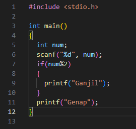
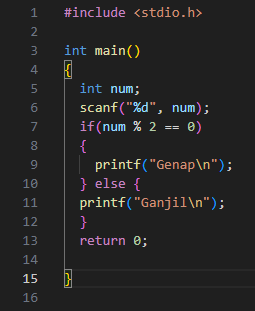
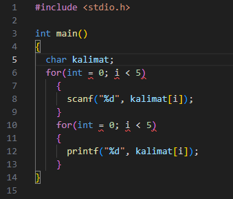
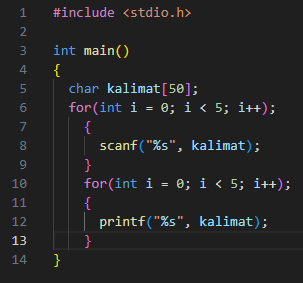

# REPORT TUGAS ASISTENSI
Ini adalah laporan perbaikan dan pengerjaan tugas Asistensi

# SOAL 1
Sebelum Perbaikan :

Setelah Perbaikan :

Penjelasan : 
1. Eror input pada scanf seharusnya scanf("%d", num);
2. Logika nya kurang --> hanya "if" saja berarti dia mencetak ganjil terus seharusnya ada kondisi lain dimana ada kalanya bilangan itu genap

# SOAL 2
Sebelum Perbaikan :

Setelah Perbaikan :

Penjelasan :
1. Deklarasi Salah : char kalimat; --> char kalimat[];
    beri [] untuk membatasi jumlah karakter
2. Salah Penulisan loop
    for(int = 0; i < 5) ---> for(int i = 0; i < 5; i++)
3. input string salah
    %d ---> %s

